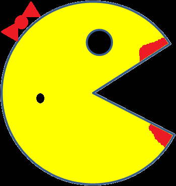

# Ms Pac-Man Factory 
Factory for making Ms Pac-Men 

## Description
In order to code the Ms Pac-Man factory, two buttons were created. The "Add Ms Pac-Man" button positions the image on the screen which is stored in the update function. When the "Move Ms Pac-Man" button is clicked, the Ms Pac-Men are added to an array which will keep track of the position and velocity of each Ms Pac-Man within the move function. This code also demostrates the ability of the Ms Pac-Men to bounce off wall due to wall detection.  

## How To Run 
Download a copy of the Ms Pac-Man repo. Drag and drop starter.html onto a blank webpage and load the page. You should see an empty Ms Pac-Man Factory with the two buttons. Press the buttons to create and move the factory.

## Roadmap
The future outcome from this project is to have the image reverse once Ms Pac-Man bounces off the wall.

## License Information
MIT 
